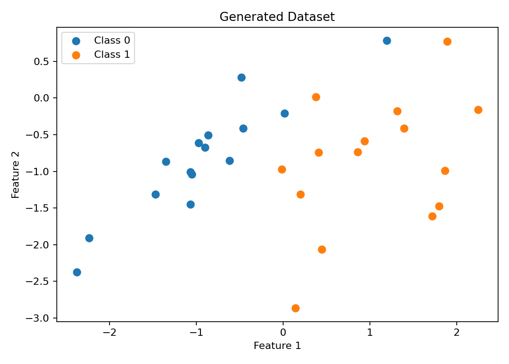
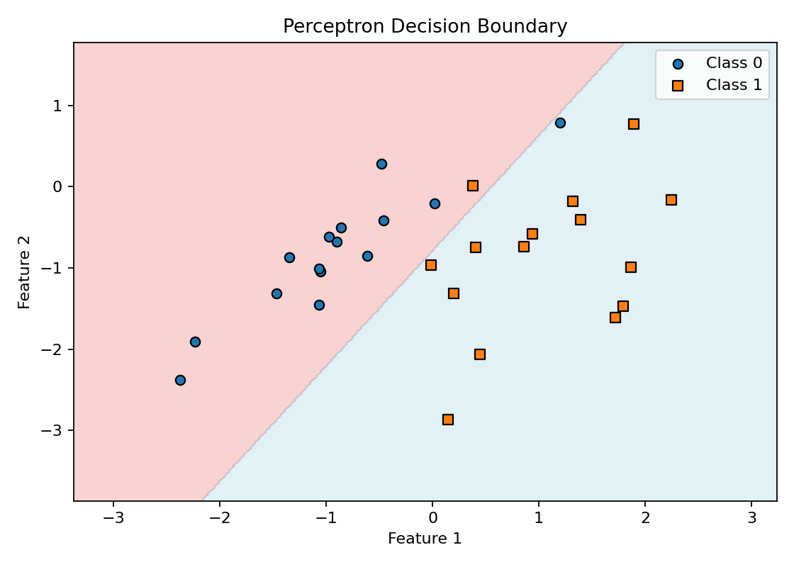

# Supervised Neural Network / Perceptron Demo

This project demonstrates a simple supervised machine learning workflow using a **Perceptron classifier** from scikit-learn.

The script generates a small two-dimensional synthetic dataset, trains a Perceptron model, reports its training accuracy, and visualizes the model's decision boundary.

## Features

- Generates a synthetic binary classification dataset
- Uses two input features for easy visualization
- Trains a scikit-learn `Perceptron`
- Prints the model's training accuracy
- Plots the generated dataset
- Plots the learned decision boundary

## Requirements

This script requires Python 3 and the following packages:

```bash
numpy
matplotlib
streamlit
scikit-learn
```

Install them with:

```bash
pip install numpy matplotlib streamlit scikit-learn
```

## Running the Program

From the project directory, run:

```bash
python supervised-nn.py
```

The program will:

1. Generate a synthetic dataset with 30 samples.
2. Display a scatter plot of the two classes.
3. Train a Perceptron classifier.
4. Print the training accuracy.
5. Display the classifier's decision boundary.

## Output

### Generated Dataset

The first plot shows the two classes in the generated two-feature dataset.



### Perceptron Decision Boundary

After training, the Perceptron divides the feature space into two predicted regions. The original samples are plotted on top of the learned decision regions.



## How It Works

### Dataset Generation

The dataset is created using `sklearn.datasets.make_classification`.

It contains:

- 30 samples
- 2 features
- 2 informative features
- 2 balanced classes
- 1 cluster per class

A fixed random seed (`300`) is used so the same dataset is generated each time the program runs.

### Model Training

The classifier is created using:

```python
Perceptron(
    max_iter=100,
    eta0=0.002,
    fit_intercept=True,
    random_state=300
)
```

The Perceptron learns a linear boundary that separates the two classes.

### Decision Boundary

To visualize the classifier, the program creates a dense grid of points covering the feature space. The trained model predicts the class of every point in the grid, and those predictions are used to draw the decision regions.

The original data points are then plotted on top of the regions.

## Project Structure

```text
ml-ai-misc/
└── supervised-neural-network/
    ├── supervised-nn.py
    ├── README.md
    ├── generated-dataset.png
    └── perceptron-decision-boundary.png
```

## Example Output

With the current settings, the training accuracy is:

```text
Training accuracy: 93.33%
```

## Notes

Although the project is named `supervised-nn.py`, the model used here is a **single Perceptron**, which is one of the simplest forms of an artificial neuron and a linear classifier.

A multi-layer neural network would typically use multiple connected layers and nonlinear activation functions.

## Purpose

This project is intended as a simple introduction to supervised learning, binary classification, Perceptrons, and visualizing decision boundaries with Python.
